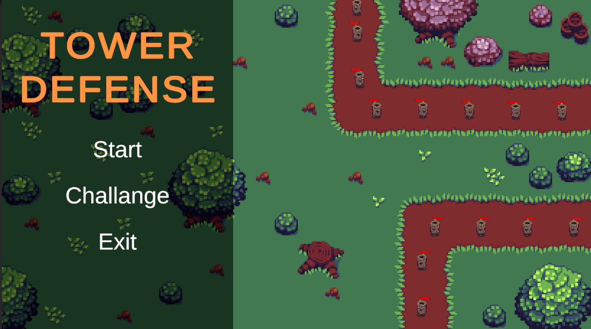
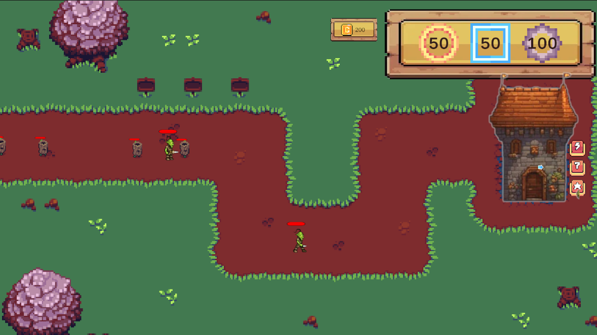
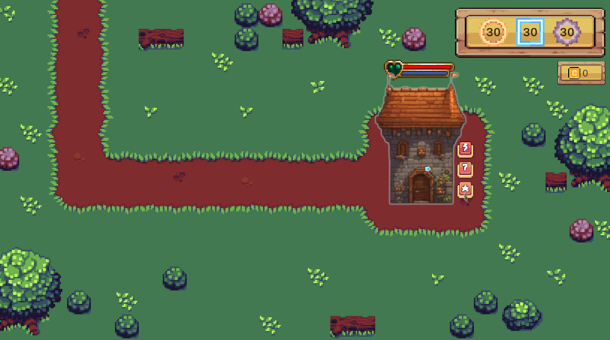

# Chào mừng đến với **Tower Defense: Cuộc Chiến Tối Thượng!** 🎮🏰

Xin chào, người bảo vệ dũng cảm! 🌟

Bạn đã sẵn sàng để tham gia vào trò chơi phòng thủ tháp hấp dẫn nhất từng được tạo ra chưa?  
Hãy chuẩn bị bảo vệ vương quốc của bạn, lên kế hoạch phòng thủ và tiêu diệt các đợt tấn công không ngừng của kẻ thù trong **Tower Defense: Cuộc Chiến Tối Thượng!** 🏹⚔️

## Có gì hấp dẫn? 🐝

Trong **Tower Defense: Cuộc Chiến Tối Thượng**, bạn là tuyến phòng thủ cuối cùng chống lại các đợt tấn công của kẻ thù quyết tâm phá hủy vương quốc của bạn.  
Với trí tuệ chiến lược và phản xạ nhanh nhạy, bạn sẽ đặt các tháp phòng thủ mạnh mẽ, nâng cấp chúng và tung ra các kỹ năng đặc biệt để giữ kẻ thù ở xa.  
Bạn có thể đối mặt với thử thách và trở thành người bảo vệ tối thượng không?🌟

## DEMO

## Tính năng nổi bật 🔥

- **Trận chiến hoành tráng**: Đối mặt với các đợt tấn công của kẻ thù với khả năng và sức mạnh độc đáo. Mỗi cấp độ mang đến những thử thách và bất ngờ mới!💥
- **Lối chơi chiến lược**: Lên kế hoạch phòng thủ cẩn thận. Đặt các tháp phòng thủ một cách chiến lược để tối đa hóa hiệu quả và giữ kẻ thù ở xa.🧠
- **Nâng cấp tháp**: Nâng cấp các tháp của bạn với các cải tiến mạnh mẽ. Tăng tầm bắn, tốc độ bắn và nhiều hơn nữa để thay đổi cục diện trận chiến!🚀
- **Kỹ năng đặc biệt**: Tung ra các kỹ năng đặc biệt để tiêu diệt kẻ thù. Thời gian là tất cả! ⏳
- **Đồ họa đẹp mắt**: Đắm mình trong hình ảnh tuyệt đẹp và môi trường sống động. Mỗi trận chiến là một bữa tiệc cho đôi mắt!🎨
- **Cấp độ thử thách**: Kiểm tra kỹ năng của bạn qua nhiều cấp độ với độ khó tăng dần. Chỉ những người giỏi nhất mới sống sót!🏆

## Cách chơi 🎮

1. **Thiết lập phòng thủ**: Đặt các tháp phòng thủ của bạn một cách chiến lược dọc theo con đường để ngăn chặn kẻ thù.
2. **Nâng cấp tháp**: Sử dụng tài nguyên để nâng cấp các tháp và tăng cường khả năng của chúng.
3. **Tung ra kỹ năng đặc biệt**: Sử dụng các kỹ năng đặc biệt vào đúng thời điểm để thay đổi cục diện trận chiến.
4. **Bảo vệ tháp chính**: Bảo vệ tháp chính của bạn bằng mọi giá. Nếu nó bị phá hủy, trò chơi kết thúc!
5. **Chiến thắng trận chiến**: Đánh bại tất cả các đợt tấn công của kẻ thù để chiến thắng cấp độ và tiến tới thử thách tiếp theo.

## Gặp gỡ đội ngũ 👥

Chúng tôi là một đội ngũ phát triển game đam mê, yêu thích tạo ra những trải nghiệm vui nhộn và hấp dẫn. Với **Tower Defense: Cuộc Chiến Tối Thượng**, chúng tôi mong muốn mang đến cho bạn hàng giờ vui vẻ và thử thách chiến lược. Cảm ơn bạn đã tham gia vào cuộc phiêu lưu này!

## Tham gia cộng đồng 🌍

Hãy kết nối với những người bảo vệ khác! Chia sẻ chiến lược, mẹo và những chiến thắng hoành tráng của bạn với cộng đồng:

- **Discord**: [Tham gia server Discord của chúng tôi](https://discord.gg/yourdiscordlink)
- **Twitter**: [Theo dõi chúng tôi trên Twitter](https://twitter.com/yourtwitterhandle)
- **Facebook**: [Thích chúng tôi trên Facebook](https://facebook.com/yourfacebookpage)

## Phản hồi và hỗ trợ 📬

Chúng tôi rất mong nhận được phản hồi từ bạn! Nếu bạn có bất kỳ ý kiến, đề xuất hoặc cần hỗ trợ, vui lòng liên hệ với chúng tôi tại [support123@gmail.com](mailto:support@yourgameemail.com).

---

Hãy sẵn sàng bảo vệ vương quốc của bạn và trở thành nhà vô địch phòng thủ tháp tối thượng! Tải xuống **Tower Defense: Cuộc Chiến Tối Thượng** ngay bây giờ và bắt đầu trận chiến! 🏰🔥

Chúc bạn chơi vui vẻ! 🎉

---

